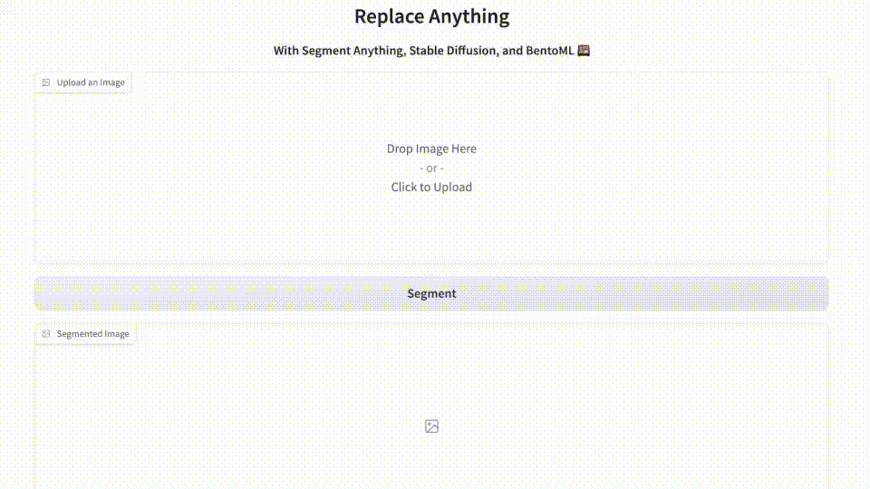
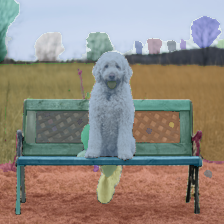

# ReplaceAnything
ReplaceAnything as you want: Ultra-high quality content replacement

[Binghui Chen](https://scholar.google.com.hk/citations?user=-2uIiz4AAAAJ&hl=zh-CN),
[Chao Li](),
[Chongyang Zhong](https://scholar.google.com.hk/citations?user=ODTZZ4wAAAAJ&hl=zh-CN),
[Wangmeng Xiang](https://scholar.google.com.hk/citations?user=LFNwNF4AAAAJ&hl=en),
[Yifeng Geng](),
[Xuansong Xie]()

Institute for Intelligent Computing, Alibaba Group

<a href='https://aigcdesigngroup.github.io/replace-anything/'></a> <a href=''></a>
---

**<span style="color:red">
News</span>**: Now you can try our ReplaceAnything v1.0 on <a href = "https://huggingface.co/spaces/modelscope/ReplaceAnything">HuggingFace space</a> ( in English ) . Enjoy it and have fun!

**<span style="color:red">
News</span>**: Now you can try our ReplaceAnything v1.0 on <a href = "https://www.modelscope.cn/studios/damo/ReplaceAnything/summary">ModelScope 魔搭</a> ( in Chinese ) . Enjoy it and have fun!


Feel free to share your interesting results with us. If you have any questions or suggestions, don't hesitate to leave a message in issues.


**<span>To Do Lists</span>**:
- [ ] Paper release
- [ ] Code release


<font color='red'>**Note: Please don't forget to give us a star if you like this project. Thanks!**</font> :stuck_out_tongue_winking_eye:

---


## Clothing replacement (masked region is strictly retained):


## Background replacement for ID photo and family photo (masked region is strictly retained):


# Replace Anything

A simple web application that lets you replace any part of an image with an image generated based on your description.



✂️ Generate a mask using the Segment Anything Model ([SAM](https://github.com/facebookresearch/segment-anything#getting-started)) by Meta AI Research. SAM is able to accurately identify and isolate the specific areas of the image that you want to edit.




🎨 Replace the specific parts of the image based on a text prompt using Diffusers library [Inpaint Pipeline](https://huggingface.co/docs/diffusers/main/en/api/pipelines/stable_diffusion/inpaint) by Hugging Face. This ensures smooth and seamless blending of the edited portions with the rest of the image, resulting in a natural and realistic final product.


🍱 Serve the application and models with Gradio on [BentoML](https://github.com/bentoml/BentoML).

## Getting Started
First download the trained model checkpoint [ViT-H SAM model](https://dl.fbaipublicfiles.com/segment_anything/sam_vit_h_4b8939.pth). 
```
./download_model.sh
```

Before running the scripts, make sure you install the dependencies.
```
pip install -r requirements.txt
```

Use bentoml to serve the model.
```
bentoml serve
```

You can access the WebUI through the /interface endpoint. The root / path is the Swagger debugging page provided by BentoML.

#
This project is intended for research purposes only and is not intended for commercial use or profit. This project is based on two open source models, Meta Segment Anything and Stable Diffusion, which are made available under the respective licenses.
